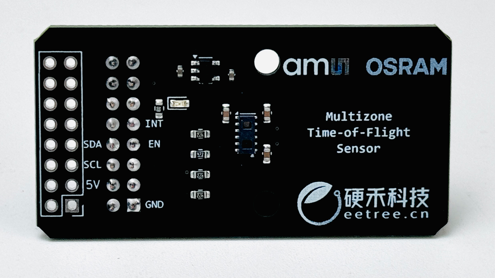
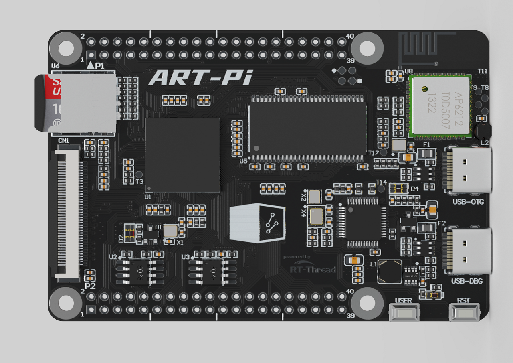
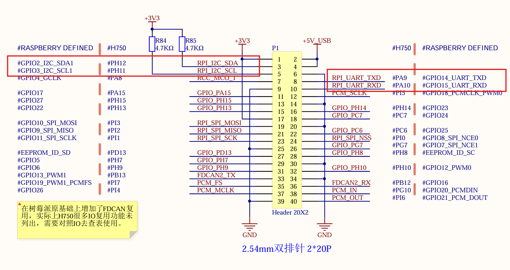

# 2024艾迈斯欧司朗竞赛 - 使用基于TMF8821的dToF传感器和ART-Pi完成平面角度测算

## 项目介绍

本项目背景是2024艾迈斯欧司朗dToF传感器光电设计竞赛，使用硬禾提供的dToF定制模块，完成给出的任务。
本项目使用dToF传感器为主体，使用ART-Pi板卡驱动,测算出传感器距离屏幕的夹角和垂直最小距离.

## 硬件说明


上图为tmf8821 dToF模块，


上图为ART-Pi开发板


上图为连接的引脚

## 方案说明

1231

## 软件说明

闪灯的源代码位于 `/projects/art_pi_blink_led/applications/main.c` 中。首先定义了一个宏 `LED_PIN` ，代表闪灯的 LED 引脚编号，然后与 `GPIO_LED_B`（**PI8**）对应：

```
#define LED_PIN GET_PIN(I, 8)
```

在 main 函数中，将该引脚配置为输出模式，并在下面的 while 循环中，周期性（500毫秒）开关 LED。

```
int main(void)
{
    rt_uint32_t count = 1;

    rt_pin_mode(LED_PIN, PIN_MODE_OUTPUT);

    while(count++)
    {
        rt_thread_mdelay(500);
        rt_pin_write(LED_PIN, PIN_HIGH);
        rt_thread_mdelay(500);
        rt_pin_write(LED_PIN, PIN_LOW);
    }
    return RT_EOK;
}
```


## 运行
### 编译&下载

编译完成后，将开发板的 ST-Link USB 口与 PC 机连接，然后将固件下载至开发板。

### 运行效果

正常运行后，蓝色 LED 会周期性闪烁。

## 心得体会

下次一定

